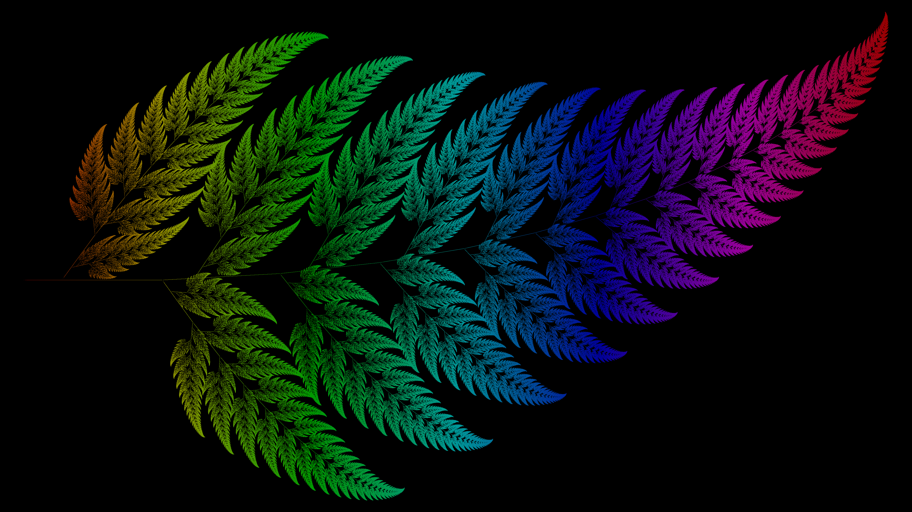

## Barnsley Fern Image Generator



Generate high quality Images of the [Barnsley Fern Fractal](https://en.wikipedia.org/wiki/Barnsley_fern).

### Usage

Install [Java](https://www.oracle.com/java/technologies/downloads/) on your device.

Download the [BarnsleyFern.java](BarnsleyFern.java) file and compile / run it by executing the following [commands](#commands).

#### Commands

Execute the following commands in the terminal in the same directory as the [BarnsleyFern.java](BarnsleyFern.java) file.

```
javac BarnsleyFern.java
java BarnsleyFern
```

### Issues

When generating extremely large images (ex. 16k resolution) the program will throw an OutOfMemory Error due to the heap memory being unable to accomodate the large size of the image data buffer. 

It is possible to manually increase the maximum heap memory using the `-Xmx` flag.

When running the `java BarnsleyFern` command, pass the `-Xmx` flag between `java` and `BarnsleyFern` followed by (without spaces) the amount and the unit of the new Heap Memory.

Format: `-Xmx{amount}{unit}`\
Unit should be `m` for MB or `g` for GB.

Ex: `java -Xmx8g BarnsleyFern`

Find more information about the `-Xmx` [flag](https://docs.oracle.com/en/java/javase/20/docs/specs/man/java.html#:~:text=XX%3AInitialHeapSize.-,%2DXmx,-size)

### Credits

- Inspired by : [The Coding Train](https://www.youtube.com/watch?v=JFugGF1URNo)
- Wikipedia : [Barnsley Fern](https://en.wikipedia.org/wiki/Barnsley_fern)